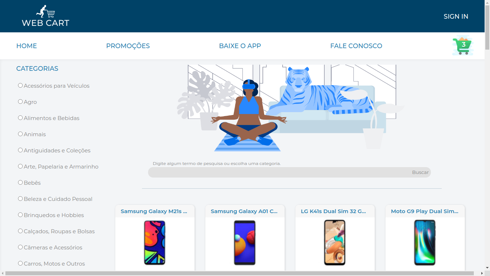
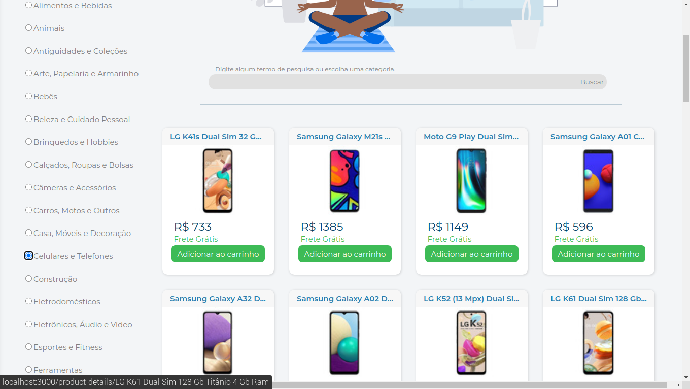
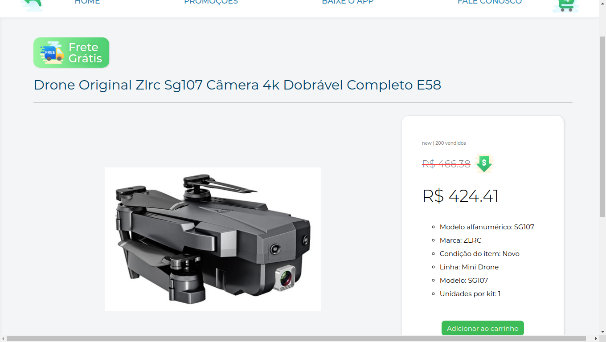
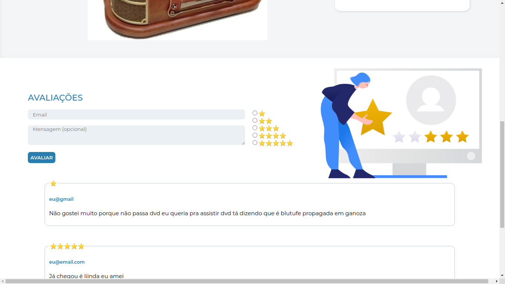
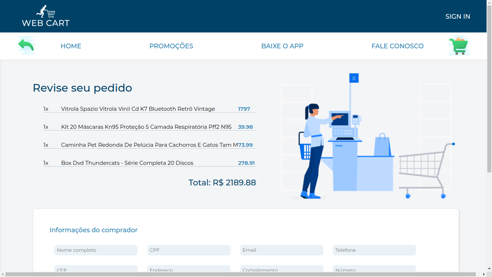
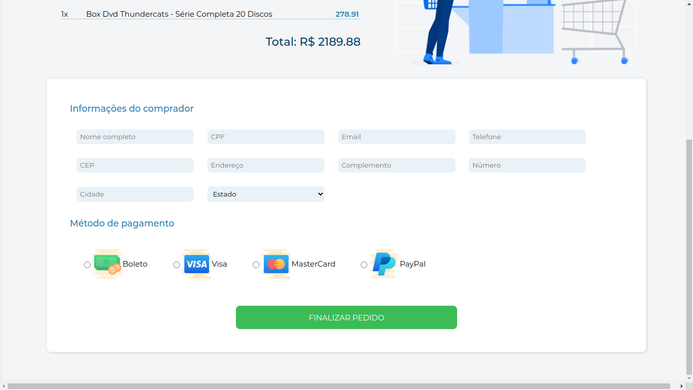
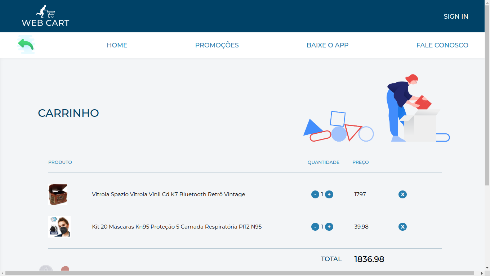
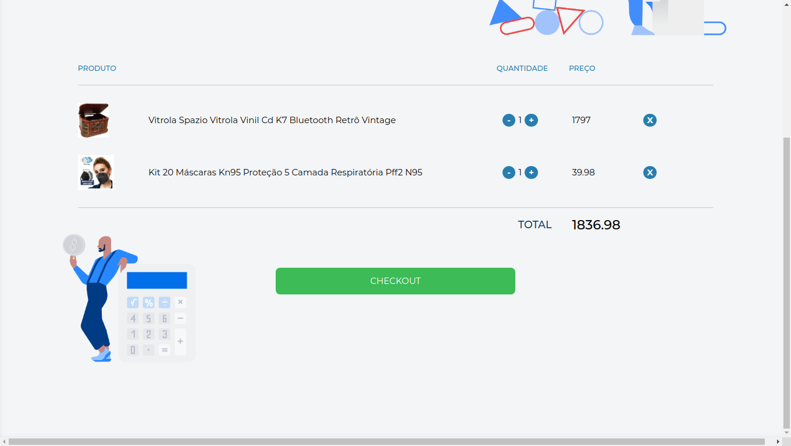

# Front-End Online Store

Projeto desenvolvido em equipe: 

[Beatriz](https://github.com/Btriz) |
[Diego](https://github.com/DiegoDemontier) |
[Heitor](https://github.com/heitorgsantos) | [Thaís](https://github.com/castrothais)
## O que foi desenvolvido

Neste projeto criamos uma versão simplificada, sem persistência no banco de dados, de uma **loja online**, desenvolvendo em grupo as funcionalidades de acordo com demandas definidas em um quadro _Kanban_, em um cenário mais próximo ao do mercado de trabalho. A partir dessas demandas, temos uma aplicação onde os usuários poderão:
  - Buscar produtos por termos e categorias a partir da _API do Mercado Livre_;
  - Interagir com os produtos buscados de modo a adicioná-los e removê-los de um carrinho de compras em diferentes quantidades;
  - Visualizar detalhes e avaliações prévias de um produto, bem como criar novas avaliações;
  - E por fim, finalizar a compra (simulada) dos itens selecionados.

---
# Habilidades

Nesse projeto, fomos capazes de:

* Entender o que são Métodos Ágeis
* Entender o que é Kanban
* Entender o que é Scrum
* Trabalhar em equipes utilizando Kanban ou Scrum de maneira eficaz
* Praticar todas as habilidades desenvolvidas até agora no módulo de Front-End

--- 

